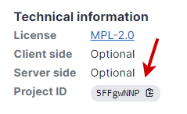

# Modrinth Modpacks

[Modrinth Modpacks](https://modrinth.com/modpacks) can automatically be installed along with the required mod loader (Forge or Fabric) by setting `MOD_PLATFORM` or `TYPE` to "MODRINTH". Upgrading (and downgrading) takes care of cleaning up old files and upgrading (and downgrading) the mod loader.

## Modpack project

The desired modpack project is specified with the `MODRINTH_MODPACK` environment variable and must be one of:

- The project "slug", which is located in the URL shown here:

  

- The project ID, which is located in the bottom of the left panel, shown here

  

- The project page URL, such as <https://modrinth.com/modpack/cobblemon-fabric>. As described below, this can further be the page URL of a modpack's version page.

- A custom URL of a hosted [mrpack file](https://support.modrinth.com/en/articles/8802351-modrinth-modpack-format-mrpack)

- The container path to a local [mrpack file](https://support.modrinth.com/en/articles/8802351-modrinth-modpack-format-mrpack)

## Modpack version

The automatic modpack version resolving can be narrowed in a few ways:

The latest release or beta version, respectively, of the Modrinth modpack is selected when `VERSION` is "LATEST" or "SNAPSHOT". That can be overridden by setting `MODRINTH_DEFAULT_VERSION_TYPE` to "release", "beta", or "alpha".

The resolved modpack version can be narrowed by setting `VERSION` to a specific Minecraft version, such as "1.19.2".

The selected version can also be narrowed to a particular mod loader by setting `MODRINTH_LOADER` to either "forge", "fabric", or "quilt".

Instead of auto resolving, a specific version of modpack file can be specified by passing the version's page URL to `MODRINTH_MODPACK`, such as <https://modrinth.com/modpack/cobblemon-fabric/version/1.3.2> or by setting `MODRINTH_VERSION` to the version ID or number located in the Metadata section, as shown here


## Ignore missing files

Some mods, such as [MCInstance Loader](https://modrinth.com/mod/mcinstance-loader), use temporary files from the modpack and delete them when finished. In order to avoid the installer from detecting the absent file(s) and re-installing, those files can be ignored by passing a comma or newline delimited list to `MODRINTH_IGNORE_MISSING_FILES`.

!!! example

    In a Compose file
    ```yaml
      environment:
        MODRINTH_IGNORE_MISSING_FILES: |
          config/mcinstanceloader/pack.mcinstance
    ```

## Excluding files

To exclude client mods that are incorrectly declared by the modpack as server-compatible, set `MODRINTH_EXCLUDE_FILES` to a comma or newline delimited list of partial file names to exclude. You may need to set `MODRINTH_FORCE_SYNCHRONIZE` to "true" while iterating on a compatible set of mods to use.

!!! example

    In a Compose file:
    ```yaml
      MODRINTH_EXCLUDE_FILES: |
        notenoughanimations
        lambdynamiclights
        euphoriapatcher
    ```